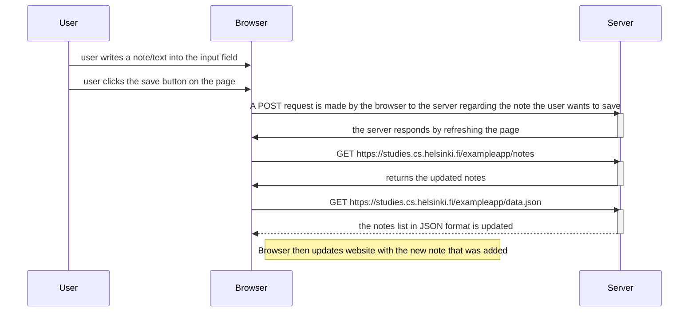

```mermaid
sequenceDiagram
participant User
participant Browser
participant Server

User->>Browser: user writes a note/text into the input field
User->>Browser: user clicks the save button on the page

Browser->>Server: A POST request is made by the browser to the server regarding the note the user wants to save
activate Server
Server->>Browser: the server responds by refreshing the page
deactivate Server

Browser->>Server: GET https://studies.cs.helsinki.fi/exampleapp/notes
activate Server
Server->>Browser: returns the updated notes
deactivate Server

Browser->>Server: GET https://studies.cs.helsinki.fi/exampleapp/data.json
activate Server
Server-->>Browser: the notes list in JSON format is updated
deactivate Server

Note right of Browser: Browser then updates website with the new note that was added

```