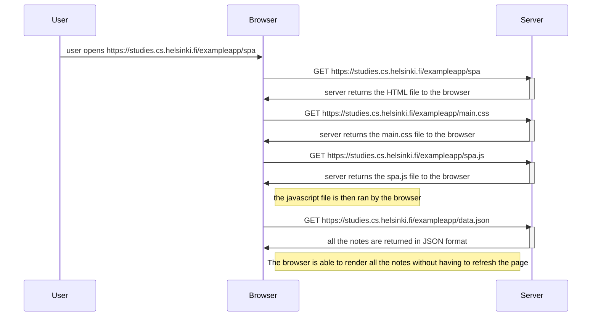

```mermaid
sequenceDiagram
participant User
participant Browser
participant Server

User->>Browser: user opens https://studies.cs.helsinki.fi/exampleapp/spa

Browser->>Server: GET https://studies.cs.helsinki.fi/exampleapp/spa
activate Server
Server->>Browser: server returns the HTML file to the browser
deactivate Server

Browser->>Server: GET https://studies.cs.helsinki.fi/exampleapp/main.css
activate Server
Server->>Browser: server returns the main.css file to the browser
deactivate Server

Browser->>Server: GET https://studies.cs.helsinki.fi/exampleapp/spa.js
activate Server
Server->>Browser: server returns the spa.js file to the browser
deactivate Server

Note right of Browser: the javascript file is then ran by the browser

Browser->>Server: GET https://studies.cs.helsinki.fi/exampleapp/data.json
activate Server
Server->>Browser: all the notes are returned in JSON format
deactivate Server

Note right of Browser: The browser is able to render all the notes without having to refresh the page

```