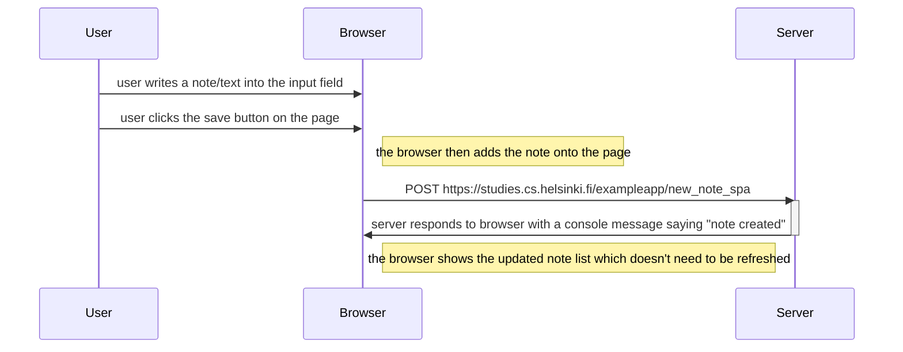

```mermaid
sequenceDiagram
participant User
participant Browser
participant Server

User->>Browser: user writes a note/text into the input field
User->>Browser: user clicks the save button on the page

Note right of Browser: the browser then adds the note onto the page

Browser->>Server: POST https://studies.cs.helsinki.fi/exampleapp/new_note_spa
activate Server
Server->>Browser: server responds to browser with a console message saying "note created"
deactivate Server

Note right of Browser: the browser shows the updated note list which doesn't need to be refreshed

```